# Проект по автоматизации тестовых сценариев для приложения [Wikipedia](https://github.com/wikimedia/apps-android-wikipedia)

<div align="center">

</div>

## :scroll: Содержание:

- [Используемый стек](#computer-используемый-стек)
- [Запуск автотестов](#arrow_forward-запуск-автотестов)
- [Сборка в Jenkins](#-сборка-в-jenkins)
- [Пример Allure-отчета](#-пример-allure-отчета)
- [Интеграция с Allure TestOps](#-интеграция-с-allure-testOps)
- [Уведомления в Telegram](#-уведомления-в-telegram)
- [Видео примера запуска тестов в BrowserStack](#-видео-примера-запуска-теста-в-selenoid)

## :computer: Используемый стек

<p align="center">
<a href="https://www.jetbrains.com/idea/"></a>
<a href="https://www.java.com/"></a>
<a href="https://selenide.org/"></a>
<a href="https://www.browserstack.com/"></a>
<a href="https://github.com/allure-framework/allure2"></a>
<a href="https://qameta.io/"></a>
 <a href="https://gradle.org/"></a>
<a href="https://junit.org/junit5/"></a>
<a href="http://appium.io/docs/en/2.1/">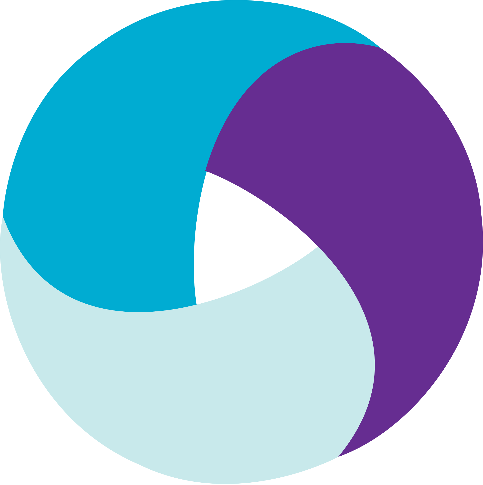</a>
<a href="https://github.com/"></a>
<a href="https://www.jenkins.io/"></a>
<a href="https://web.telegram.org/"></a>
</p>

Автотесты в этом проекте написаны на `Java` с использованием фреймворка `Selenide`.\
`Gradle` - используется как инструмент автоматизации сборки.  \
`JUnit5` - для выполнения тестов.\
`Jenkins` - CI/CD для запуска тестов удаленно.\
`Browserstack` - для запуска мобильных тестов удаленно.\
`Appium` - для взаимодействия с мобильным устройством.\
`Allure Report` - для визуализации результатов тестирования.\
`Telegram Bot` - для уведомлений о результатах тестирования.\
`Allure TestOps` - как система управления тестированием.

**Особенности проекта**:
- `Screen Object` шаблон проектирования
- Различные конфигурации для запуска теста в зависимости от параметров сборки
- Использование технологии `Owner`
- Возможность запуска тестов локально или удалённо
- Возможность запуска тестов напрямую из Allure TestOps
- Автотесты как тестовая документация
- Уведомление о результатах прохождения в Telegram
- По итогу прохождения автотестов генерируется Allure отчет. Содержание отчета:
    - Шаги теста
    - Исходный код страницы в браузере
    - Видео выполнения автотеста

## Реализованные проверки
### Mobile
- [x] Проверка наличия и обязательности капчи при авторизации
- [x] Осуществляется проверка на валидность Username при регистрации
- [x] Проверка сохранения статьи

## :arrow_forward: Запуск автотестов

Дополнительные свойства извлекаются из соответствующего файла конфигурации:
```
./resources/test.config
```

`deviceHost` - определяет среду для запуска тестов:
>- *emulator* - для локального запуска (значение по-умолчанию)
>- *browserstack* - для удаленного запуска

### Запуск тестов из терминала
Для локального запуска тестов в терминале IDE нужно ввести:
```
gradle clean test
```
Для удаленного запуска в эмуляторе <code>BrowserStack</code> в терминале IDE нужно ввести:
```
gradle clean test -DdeviceHost=browserstack -Dbrowserstack.user=${USER} -Dbrowserstack.key=${KEY}
```
- `-DdeviceHost` - параметр, позволяющий выбрать запуск удаленно <code>browserstack</code> или локально <code>emulator</code>.
- `-Dbrowserstack.user` - имя юзера в Browserstack.
- `-Dbrowserstack.key` - пароль юзера в Browserstack.

Можно добавить параметры:
- `-Durl` - url хоста для удаленного запуска.
- `-Dversion` - версия Android
- `-Ddevice` - модель устройства на базе Android

##  Сборка в <b><a target="_blank" href="https://jenkins.autotests.cloud/job/c36-evded-qa-guru-HW-diploma-mobile/">Jenkins</a></b>

Для запуска сборки необходимо перейти в раздел <code>Build with Parameters</code> и нажать кнопку <code>Build</code>.
<p align="center">
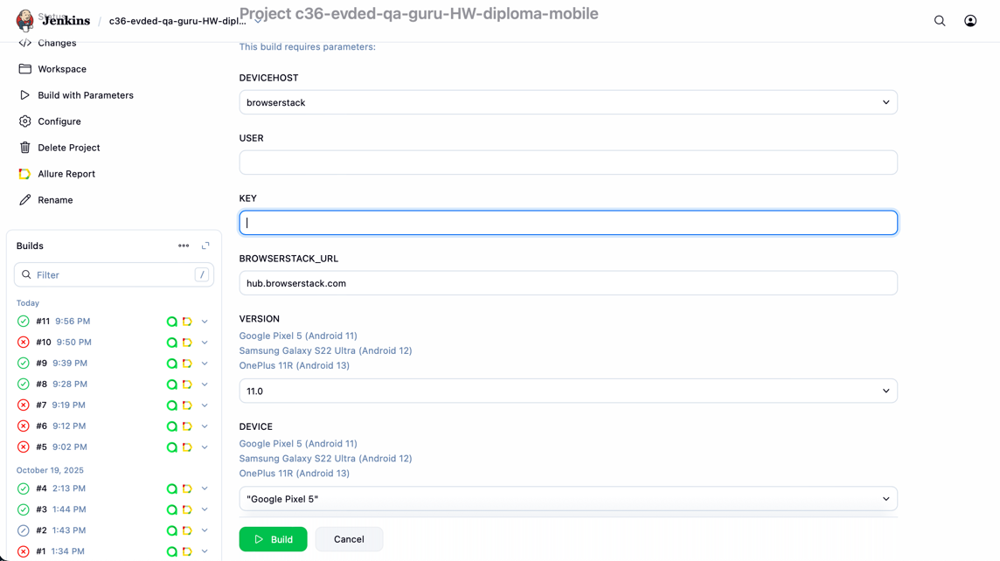
</p>

После выполнения сборки, в блоке <code>История сборок</code> напротив номера сборки появятся значки <code>Allure Report</code> и <code>Allure TestOps</code>, при клике на которые откроется страница с сформированным html-отчетом и тестовой документацией соответственно.
<p align="center">
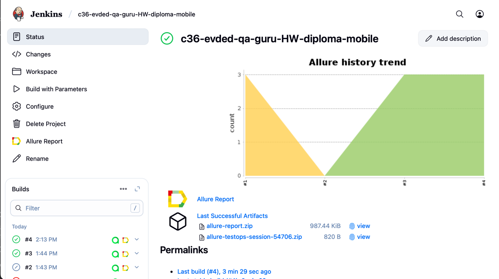
</p>

##  Пример <b><a target="_blank" href="https://jenkins.autotests.cloud/job/c36-evded-qa-guru-HW-diploma-mobile/4/allure/#">Allure-отчета</a></b>
### Overview
Главная страница отчета Allure содержит следующие блоки:

>- <code><strong>*ALLURE REPORT*</strong></code> - отображает дату и время теста, общее количество запущенных тестов, а также диаграмму с процентом и количеством успешных, упавших и сломавшихся в процессе выполнения тестов
>- <code><strong>*TREND*</strong></code> - отображает тенденцию выполнения тестов для всех запусков
>- <code><strong>*SUITES*</strong></code> - отображает распределение тестов по сьютам
>- <code><strong>*CATEGORIES*</strong></code> - отображает распределение неудачных тестов по типам дефектов

<p align="center">
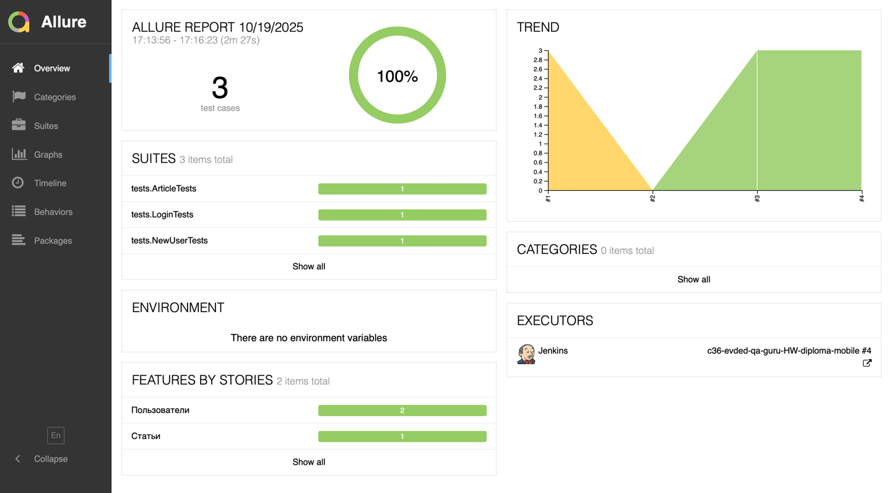
</p>

### Список тестов с шагами и тестовыми артефактами
На странице список тестов, сгруппированных по наборам, с указанием статуса для каждого теста.\
Может быть показана полная информация о каждом тесте: теги, продолжительность, подробные шаги.

<p align="center">
  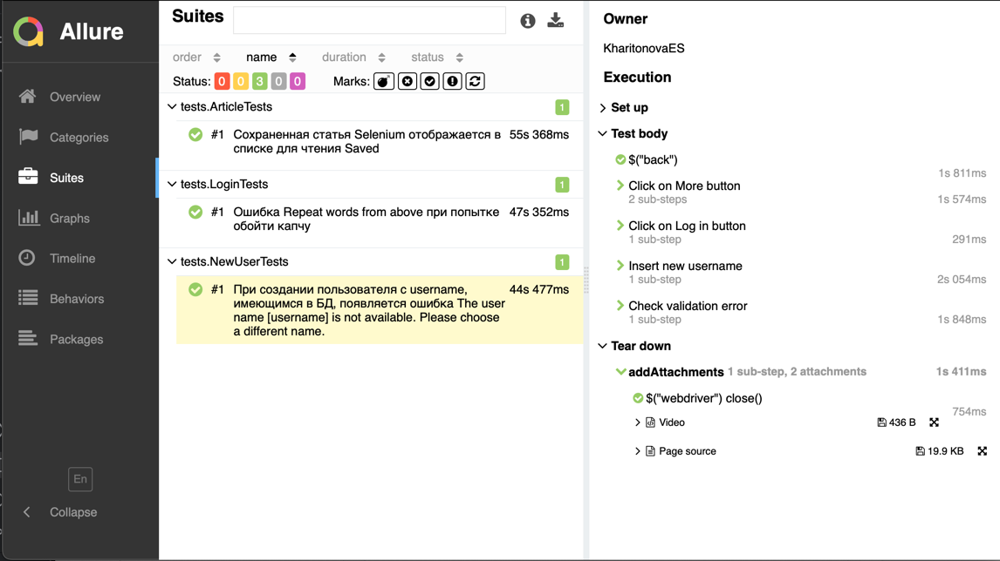
</p>

Также доступны дополнительные тестовые артефакты:
>- Page Source
>- Video

<p align="center">
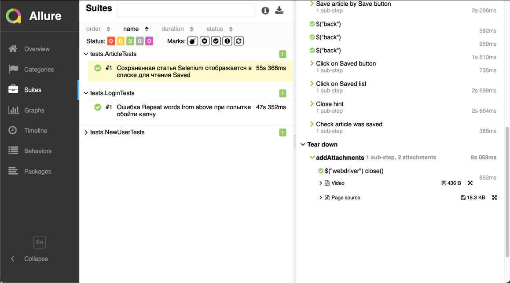
</p>

##  Интеграция с <b><a target="_blank" href="https://allure.autotests.cloud/project/4965/dashboards">Allure TestOps</a></b>

Выполнена интеграция сборки <code>Jenkins</code> с <code>Allure TestOps</code>.
Результат выполнения автотестов отображается в <code>Allure TestOps</code>
На Dashboard в <code>Allure TestOps</code> отображена статистика пройденных тестов.

<p align="center">
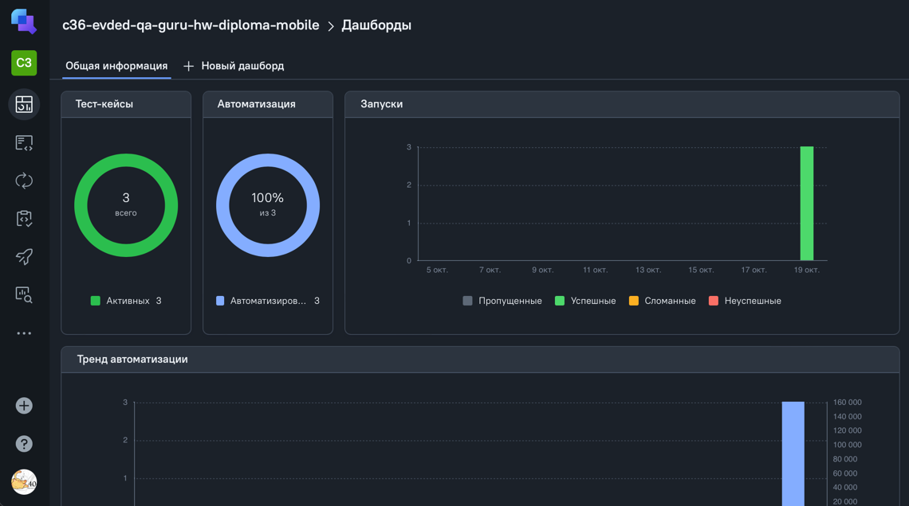
</p>

Тест-кейсы в проекте импортируются и постоянно обновляются из кода,
поэтому нет необходимости в синхронизации ручных тест-кейсов и автотестов.\
Достаточно создать и обновить автотест в коде и тест-кейс всегда будет в актуальном состоянии.

### Результат выполнения автотестов в <b><a target="_blank" href="https://allure.autotests.cloud/launch/48860/tree/734339?search=W3siaWQiOiJzdGF0dXMiLCJ0eXBlIjoidGVzdFN0YXR1c0FycmF5IiwidmFsdWUiOlsicGFzc2VkIl19XQ%3D%3D&treeId=0">TestOps</a></b>

<p align="center">
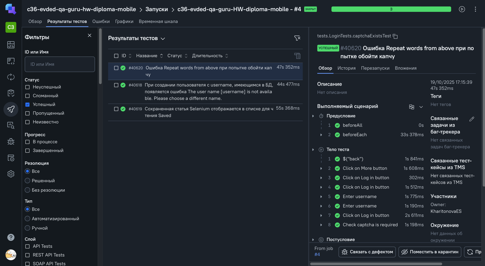
</p>

## Allure TestOps Test Cases

<p align="center">
  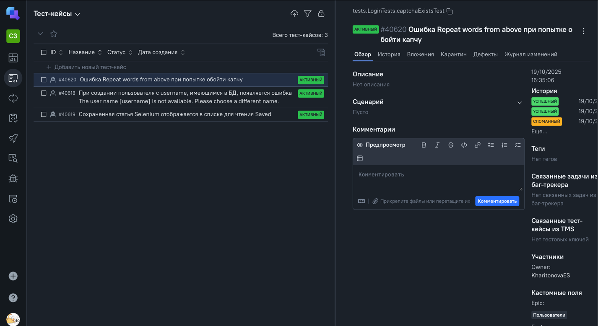
</p>

###  Уведомления в Telegram с использованием бота

После завершения сборки специальный бот, созданный в <code>Telegram</code>, автоматически обрабатывает и отправляет сообщение с отчетом о прогоне тестов.

<p align="center">
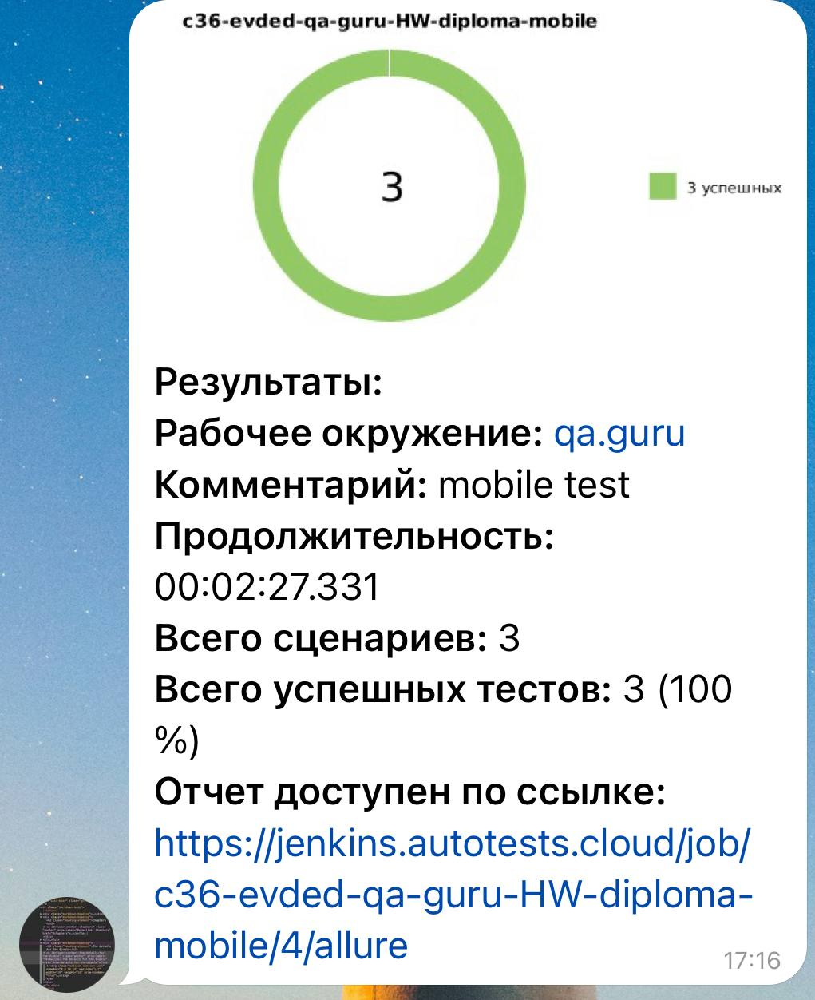
</p>

###  Видео примера запуска тестов в <b><a target="_blank" href="https://app-automate.browserstack.com/projects/Diploma+Java+Project/builds">BrowserStack</a></b>

В отчете Allure прикреплено видео прохождения теста на мобильном устройстве
<p align="center">
  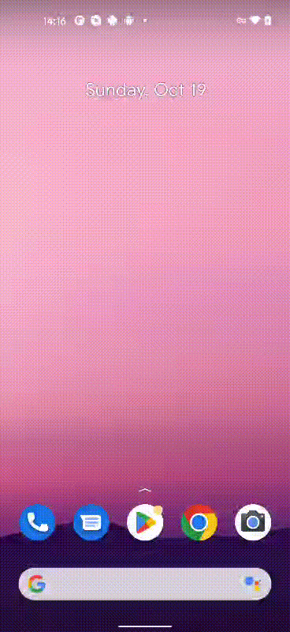
</p>